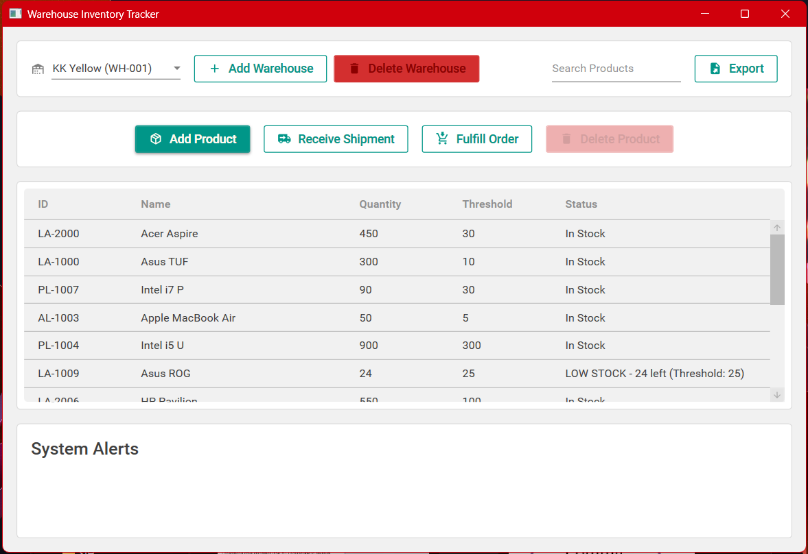
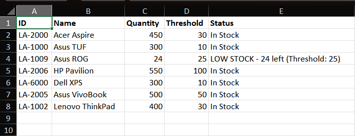

# 📦 Warehouse Inventory Tracker

A modern, real-time, event-driven warehouse management system built with C# and WPF. This application demonstrates the use of the Observer pattern for event-driven notifications, MVVM for UI separation, and async operations for a responsive user experience, all wrapped in a beautiful Material Design interface.


## 🎨 Screenshot

<br>


## ✨ Features

-   🏭 **Multi-Warehouse Support**: Create and manage inventory for multiple warehouses.
-   📦 **Product Management**: Dynamically add new products with a unique ID, name, quantity, and reorder threshold.
-   📈 **Stock Operations**: Easily receive shipments (increase stock) and fulfill customer orders (decrease stock).
-   🔔 **Event-Driven Alerts**: Automatically triggers "Restock Alerts" when a product's quantity falls below its predefined threshold using the Observer pattern.
-   💾 **Data Persistence**: Saves the inventory state to a simple text file (`warehouse_data.txt`) between application runs.
-   🔍 **Real-Time Search**: Filter products in the list by their ID or name as you type.
-   ⚡ **Responsive UI**: All stock update operations are performed asynchronously to prevent the UI from freezing.
-   🗑️ **Safe Deletion**: Includes confirmation dialogs for deleting products and a "type-to-confirm" mechanism for deleting entire warehouses to prevent accidental data loss.

## 🛠️ Technology Stack

-   **.NET 8**
-   **C#**
-   **WPF** (Windows Presentation Foundation)
-   **Material Design in XAML**
-   **MVVM** (Model-View-ViewModel) Pattern
-   **Observer** Design Pattern

## 📁 Project Structure

```
WarehouseInventoryTracker/
├── WarehouseInventoryTracker.sln          # Solution file
│
├── WarehouseInventoryTracker/             # Main project folder
│   ├── App.xaml                           # Application definition & theme resources
│   ├── MainWindow.xaml                    # Main window UI
│   ├── MainWindow.xaml.cs                 # Main window code-behind
│   │
│   ├── Models/                            # Data models
│   │   ├── Product.cs                     # Product entity
│   │   └── IStockObserver.cs              # Observer interface
│   │
│   ├── Services/                          # Business logic services
│   │   ├── Warehouse.cs                   # Core warehouse logic
│   │   ├── AlertService.cs                # Alert notification service
│   │   └── WarehouseManager.cs            # Warehouse management service
│   │
│   ├── ViewModels/                        # View models for MVVM
│   │   ├── ProductViewModel.cs            # Product view model
│   │   └── WarehouseViewModel.cs          # Warehouse view model
│   │
│   ├── Views/                             # Dialog windows
│   │   ├── AddWarehouseDialog.xaml        # Add warehouse dialog UI
│   │   ├── AddProductDialog.xaml          # Add product dialog UI
│   │   ├── QuantityDialog.xaml            # Quantity input dialog UI
│   │   └── DeleteWarehouseDialog.xaml     # Delete warehouse confirmation dialog
│   │
│   ├── EventArgs/                         # Custom event args
│   │   └── StockAlertEventArgs.cs         # Stock alert event arguments
│   │
│   └── warehouse_data.txt                 # Data persistence file (generated at runtime)
│
└── .github/workflows/                     # GitHub Actions CI/CD
    └── dotnet-ci.yml
```

## 🏗️ Architecture

The application follows the **MVVM (Model-View-ViewModel)** pattern to separate the UI from the business logic.

```
┌─────────────────────────────────────────────────────────────┐
│                        UI Layer (Views)                     │
│  ┌─────────────────┐  ┌─────────────────┐  ┌──────────────┐ │
│  │   MainWindow    │  │ AddWarehouseDlg │  │AddProductDlg │ │
│  └─────────────────┘  └─────────────────┘  └──────────────┘ │
└─────────────────────────────────────────────────────────────┘
                              │
                              ▼
┌─────────────────────────────────────────────────────────────┐
│                    ViewModel Layer                          │
│  ┌─────────────────┐    ┌───────────────────┐               │
│  │ ProductViewModel│    │WarehouseViewModel │               │
│  └─────────────────┘    └───────────────────┘               │
└─────────────────────────────────────────────────────────────┘
                              │
                              ▼
┌─────────────────────────────────────────────────────────────┐
│                   Service Layer                             │
│  ┌─────────────────┐  ┌─────────────────┐  ┌──────────────┐ │
│  │ WarehouseManager│  │   Warehouse     │  │ AlertService │ │
│  └─────────────────┘  └─────────────────┘  └──────────────┘ │
└─────────────────────────────────────────────────────────────┘
                              │
                              ▼
┌─────────────────────────────────────────────────────────────┐
│                     Model Layer                             │
│  ┌─────────────────┐  ┌─────────────────┐                   │
│  │     Product     │  │  IStockObserver │                   │
│  └─────────────────┘  └─────────────────┘                   │
└─────────────────────────────────────────────────────────────┘
```

## 🚀 Getting Started

### Prerequisites

-   .NET 8.0 SDK or later
-   Visual Studio 2022 or a compatible C# IDE

### Setup and Run

1.  **Clone the Repository:**
    ```bash
    git clone https://github.com/thishahid/Warehouse-Inventory-Tracker_JIT.git
    cd Warehouse-Inventory-Tracker_JIT
    ```

2.  **Open the Solution:**
    -   Open `WarehouseInventoryTracker.sln` in Visual Studio.

3.  **Build and Run:**
    -   Press `F5` or go to `Debug > Start Debugging` in Visual Studio to build and run the application.

## 📖 How to Use the Application

1.  **Add a Warehouse**: On launch, click the "Add Warehouse" button. Enter a unique ID and a name (e.g., ID: `WH-01`, Name: `Main Warehouse`).

2.  **Select a Warehouse**: Choose your newly created warehouse from the dropdown list.

3.  **Add a Product**: Click the "Add Product" button. Enter the product details (e.g., ID: `LP-001`, Name: `Laptop`, Initial Quantity: `10`, Reorder Threshold: `5`).

4.  **Manage Stock**: Select a product from the grid and use the "Receive Shipment" or "Fulfill Order" buttons to adjust its quantity.

5.  **Observe Alerts**: When a product's quantity drops below its threshold, an alert message will appear in the alert box at the bottom of the window.

6.  **Search Products**: Use the "Search" box at the top to filter the product list in real-time.

7.  **Delete Items**: Use the "Delete Product" button to remove a selected product (with confirmation) or the "Delete Warehouse" button to remove the entire warehouse (requires typing the warehouse name to confirm).

## 💡 Code Highlights

-   **Observer Pattern for Alerts**: The `Warehouse` class acts as the "Subject," and the `AlertService` acts as an "Observer." When stock levels change, the `Warehouse` notifies all registered observers, decoupling the alerting logic from the core warehouse operations.

    ```csharp
    // In Warehouse.cs
    private void NotifyObservers(Product product)
    {
        _observerLock.EnterReadLock();
        try
        {
            foreach (var observer in _observers)
            {
                observer.OnStockBelowThreshold(product);
            }
        }
        finally
        {
            _observerLock.ExitReadLock();
        }
    }
    ```

-   **Async/Await for Responsive UI**: All data-modifying operations are `async` and use `await` to ensure the UI thread never gets blocked, providing a smooth user experience.

    ```csharp
    // In MainWindow.xaml.cs
    private async void AddProductButton_Click(object sender, RoutedEventArgs e)
    {
        // ... dialog logic ...
        await _warehouseManager.AddProductAsync(_currentWarehouse.Id, product);
        RefreshProductList();
    }
    ```

-   **Safety Mechanisms**: Deletion operations are protected by confirmation dialogs. The "Delete Warehouse" feature requires the user to type the exact warehouse name, preventing catastrophic accidental data loss.

## 🚀 Future Enhancements

-   **Advanced Multithreading**: Implement a more sophisticated system for handling simultaneous stock updates from multiple sources.
-   **Improved Persistence**: Replace the simple text file with a more robust format like JSON or a lightweight database (e.g., SQLite).
-   **Reporting and Analytics**: Add features to generate reports on inventory turnover, sales, and restocking needs.
-   **User Authentication**: Implement a login system with different user roles (e.g., Admin, Clerk) with varying permissions.

## 📄 License

This project is licensed under the MIT License. See the [LICENSE](LICENSE) file for details.

---

Happy Coding! 🎉
